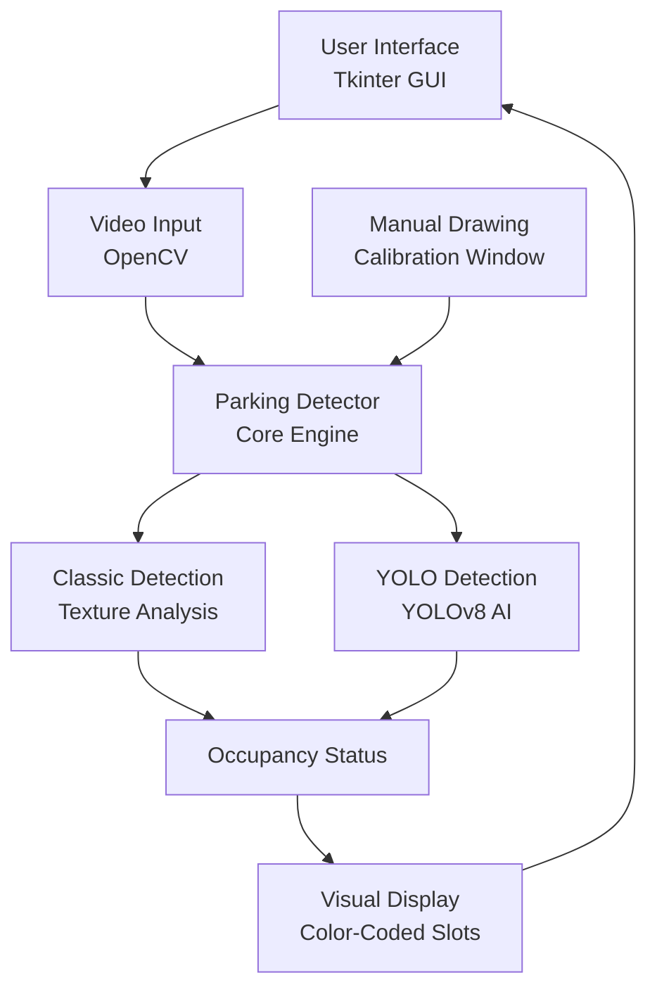

# Smart Parking Slot Detection System
## Project Report

---

## Executive Summary

The **Smart Parking Slot Detection System** is an intelligent computer vision application that automatically monitors parking lot occupancy in real-time using video feeds. The system combines manual slot definition with advanced AI-powered vehicle detection to provide accurate, real-time parking availability information.

**Project Type:** Computer Vision & AI Application  
**Domain:** Smart City Infrastructure  
**Technology Stack:** Python, OpenCV, YOLOv8, Tkinter

---

## Project Objectives

1. **Automated Parking Monitoring**: Eliminate manual parking lot monitoring by automating occupancy detection
2. **Real-time Analysis**: Provide instant parking availability statistics
3. **User-Friendly Interface**: Enable easy slot configuration through manual drawing interface
4. **Scalable Solution**: Support multiple parking lot configurations and camera angles
5. **AI-Powered Detection**: Leverage state-of-the-art YOLO object detection for accurate vehicle identification

---

## Key Features

### Core Functionality
- **Manual Slot Definition**: Intuitive polygon drawing interface for defining parking spaces
- **Real-time Video Processing**: Live analysis of parking lot video feeds
- **Dual Detection Modes**:
  - **Classic Mode**: Texture-based occupancy detection
  - **YOLO Mode**: AI-powered vehicle detection using YOLOv8
- **Live Statistics Dashboard**: Real-time display of total, free, and occupied parking slots
- **Visual Feedback**: Color-coded slot visualization (Green = Free, Red = Occupied)

### User Interface Features
- **Modern Dark Theme**: Professional, eye-friendly interface
- **Scrollable Sidebar**: Compact control panel with all essential functions
- **Video Playback Controls**: Start/Stop detection with frame capture capability
- **Configuration Persistence**: Save and load parking slot configurations

---

## System Architecture

### Component Overview



### File Structure

```
smart-parking/
├── run.py                 # Application entry point
├── import cv2.py          # Main application & UI (SmartParkingApp)
├── yolo_detector.py       # YOLO-based vehicle detection
├── line_detector.py       # Line-based slot detection utilities
├── parking_slots.json     # Saved slot configurations
├── data/                  # Sample images and videos
└── images/                # Reference parking lot images
```

### Core Classes

#### 1. **ParkingSlot**
- Represents individual parking space
- Stores coordinates, ID, and occupancy status
- Handles serialization for persistence

#### 2. **ParkingDetector**
- Core detection engine
- Manages slot collection and occupancy analysis
- Supports both classic and YOLO detection modes
- Provides drawing and statistics functions

#### 3. **SmartParkingApp** (Main Application)
- Tkinter-based GUI application
- Handles video playback and user interactions
- Manages detection lifecycle
- Coordinates UI updates with detection results

#### 4. **CalibrationWindow**
- Interactive polygon drawing interface
- Allows manual slot boundary definition
- Supports adding, modifying, and deleting slots

#### 5. **YOLODetector**
- Wraps YOLOv8 object detection model
- Filters for vehicle classes (car, truck, bus, motorcycle)
- Provides bounding box predictions

---

## Technologies Used

### Core Technologies

| Technology | Purpose | Version |
|------------|---------|---------|
| **Python** | Primary programming language | 3.8+ |
| **OpenCV (cv2)** | Image processing and computer vision | 4.x |
| **NumPy** | Numerical computations | Latest |
| **Tkinter** | GUI framework | Built-in |
| **PIL (Pillow)** | Image handling for GUI | Latest |
| **Ultralytics YOLOv8** | AI-based object detection | Latest |

### Computer Vision Techniques

- **Contour Detection**: Identifying vehicle boundaries
- **Perspective Transformation**: Handling camera angle variations
- **Feature Matching**: ORB-based image alignment
- **Morphological Operations**: Noise reduction and edge enhancement
- **Hough Transform**: Line detection for parking slots

### AI/ML Components

- **YOLOv8n (Nano)**: Lightweight, fast vehicle detection model
- **Confidence Thresholding**: 25% default threshold for reliable detection
- **Multi-class Detection**: Cars, trucks, buses, motorcycles

---

## Detection Algorithms

### Classic Detection Mode (Texture-Based)

1. **Convert to grayscale** for computational efficiency
2. **Apply Gaussian blur** to reduce noise
3. **Threshold image** to create binary mask
4. **Find contours** within each slot region
5. **Calculate contour area** relative to slot size
6. **Classify occupancy** based on area threshold (>30% = occupied)

**Advantages:**
- Fast processing
- Low computational requirements
- Works in various lighting conditions

**Limitations:**
- May struggle with shadows
- Less accurate with partial occlusions

### YOLO Detection Mode (AI-Powered)

1. **Load YOLOv8 model** (one-time initialization)
2. **Run inference** on video frame
3. **Filter detections** for vehicle classes only
4. **Extract bounding boxes** for each detected vehicle
5. **Check intersection** with defined parking slots
6. **Update occupancy** based on vehicle presence

**Advantages:**
- Highly accurate vehicle recognition
- Robust to lighting variations
- Handles partial occlusions well

**Resource Requirements:**
- Higher CPU/GPU usage
- Requires ultralytics package
- Larger memory footprint

---

## Installation & Setup

### Prerequisites

```bash
# Python 3.8 or higher
python --version

# pip package manager
pip --version
```

### Installation Steps

1. **Clone or download the project**
   ```bash
   cd ~/Downloads/vsc/smart-parking
   ```

2. **Install required packages**
   ```bash
   pip install opencv-python
   pip install numpy
   pip install pillow
   pip install ultralytics  # For YOLO detection
   ```

3. **Verify installation**
   ```bash
   python run.py
   ```

### System Requirements

- **OS**: Windows, macOS, or Linux
- **RAM**: 4GB minimum, 8GB recommended
- **CPU**: Multi-core processor recommended for YOLO mode
- **GPU**: Optional, accelerates YOLO inference

---

## User Guide

### Quick Start Workflow

#### Step 1: Launch Application
```bash
python3 run.py
```

#### Step 2: Load Video
1. Click **"Load Video"** button
2. Select your parking lot video file
3. Video preview will appear in the main display

#### Step 3: Capture Reference Frame
1. Play the video or seek to a clear frame
2. Click **"Capture Frame"** button
3. Frame is saved for slot definition

#### Step 4: Define Parking Slots
1. Click **"✏️ Draw Slots Manually"** button
2. In the calibration window:
   - Click to add polygon vertices
   - Right-click to complete a slot
   - Middle-click to delete a slot
3. Click **"Save & Exit"** when done

#### Step 5: Start Detection
1. Select detection mode:
   - **Classic**: Fast, texture-based detection
   - **YOLO**: AI-powered, more accurate
2. Click **"▶ START"** button
3. Watch real-time occupancy updates

#### Step 6: Monitor Statistics
- **Total**: Number of defined parking slots
- **Free**: Available parking spaces (Green)
- **Occupied**: Occupied spaces (Red)

---

## User Interface

### Main Window Layout

```
┌─────────────────────────────────────────────────┐
│  SMART PARKING                            [AI]  │
├──────────┬──────────────────────────────────────┤
│ STATS    │                                      │
│ Total: X │                                      │
│ Free: X  │         VIDEO FEED                   │
│ Occupied │         (Live Detection)             │
├──────────┤                                      │
│ Setup    │                                      │
│ • Load   │                                      │
│   Video  │                                      │
│ • Capture│                                      │
├──────────┤                                      │
│ Detection│                                      │
│ • Draw   │                                      │
│   Manual │                                      │
├──────────┤                                      │
│ Mode     │                                      │
│ ○ Classic│                                      │
│ ○ YOLO   │                                      │
├──────────┤                                      │
│ Controls │                                      │
│ ▶ START  │                                      │
│ ⏹ STOP   │                                      │
├──────────┤                                      │
│ ❌ EXIT  │                                      │
└──────────┴──────────────────────────────────────┘
```

### Color Scheme
- **Background**: Dark theme (#1a1a1a)
- **Sidebar**: Darker shade (#0d0d0d)
- **Free Slots**: Green (#00FF00)
- **Occupied Slots**: Red (#FF0000)
- **Accent**: Electric Blue (#00D4FF)

---

## Data Persistence

### Slot Configuration Format (JSON)

```json
[
  {
    "slot_id": 1,
    "points": [[x1, y1], [x2, y2], [x3, y3], [x4, y4]],
    "occupied": false
  },
  {
    "slot_id": 2,
    "points": [[x1, y1], [x2, y2], [x3, y3], [x4, y4]],
    "occupied": false
  }
]
```

Configurations are automatically saved to `parking_slots.json` when using the "Save Configuration" button.

---

## Testing & Validation

### Test Scenarios

1. **Empty Lot**: All slots should show as free (green)
2. **Full Lot**: All slots should show as occupied (red)
3. **Mixed Occupancy**: Accurate detection of individual slot states
4. **Varying Lighting**: Consistent detection across different times of day
5. **Different Vehicle Types**: Cars, trucks, motorcycles correctly identified

### Performance Metrics

| Mode | FPS | Accuracy | CPU Usage |
|------|-----|----------|-----------|
| Classic | 25-30 | ~85% | Low |
| YOLO | 10-15 | ~95% | Medium-High |

*(Performance varies based on hardware and video resolution)*

---

## Known Limitations

1. **Camera Angle Dependency**: Best results with overhead or angled views
2. **Weather Conditions**: Heavy rain or fog may reduce accuracy
3. **Slot Overlap**: Overlapping slot definitions not supported
4. **Static Camera**: Requires fixed camera position (no pan/tilt)
5. **Manual Definition**: Initial slot setup requires manual effort

---

## Future Enhancements

### Planned Features

- [ ] **Automatic Slot Detection**: AI-based parking line recognition
- [ ] **Multi-Camera Support**: Monitor multiple parking areas simultaneously
- [ ] **Cloud Integration**: Remote monitoring via web dashboard
- [ ] **Historical Analytics**: Occupancy trends and peak hour analysis
- [ ] **Mobile App**: iOS/Android companion app
- [ ] **License Plate Recognition**: Track individual vehicles
- [ ] **Payment Integration**: Automated parking fee calculation
- [ ] **Real-time Alerts**: Notifications for available spots

### Technical Improvements

- [ ] **GPU Acceleration**: CUDA support for faster YOLO inference
- [ ] **Model Optimization**: Custom-trained YOLO for parking lots
- [ ] **Database Integration**: PostgreSQL/MongoDB for data storage
- [ ] **RESTful API**: Enable third-party integrations
- [ ] **Docker Containerization**: Easy deployment and scaling

---

## Use Cases

### Commercial Applications
- **Shopping Malls**: Guide customers to available spots
- **Airports**: Long-term and short-term parking management
- **Corporate Campuses**: Employee parking allocation
- **Hospitals**: Patient and visitor parking optimization
- **Universities**: Student and faculty parking monitoring

### Smart City Integration
- **Real-time Availability Maps**: Display on city apps
- **Traffic Reduction**: Minimize parking search time
- **Revenue Optimization**: Dynamic pricing based on demand
- **Data Analytics**: Urban planning insights

---

## References & Resources

### Documentation
- [OpenCV Documentation](https://docs.opencv.org/)
- [YOLOv8 by Ultralytics](https://docs.ultralytics.com/)
- [Tkinter GUI Guide](https://docs.python.org/3/library/tkinter.html)

### Research Papers
- Redmon et al., "You Only Look Once: Unified, Real-Time Object Detection" (2016)
- Computer Vision techniques in Smart Parking Systems

---

## License & Credits

**Project**: Smart Parking Slot Detection System  
**Team**: High Stakes  
**Institution**: Rajagiri School of Engineering and Technology  
**Year**: 2026

**Open Source Libraries Used:**
- OpenCV (Apache 2.0 License)
- YOLOv8 (AGPL-3.0 License)
- NumPy (BSD License)

---

## Contact & Support

For questions or inquiries:
- **Email**: u2409008@rajagiri.edu.in
- **Institution**: Rajagiri School of Engineering and Technology

---

**Last Updated**: January 2026  
**Version**: 1.0.0
